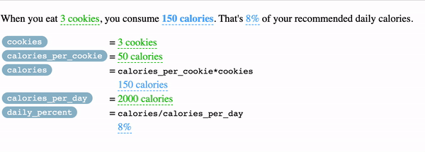

# Remark-Tangle

Remark and mdast plugins for creating interactive markdown documents.

---

Remark-Tangle extends plain text markdown with a special notation (based on links) for adding controls and variables with [Tangle](http://worrydream.com/Tangle/guide.html). It's like a lightweight and inline version of [Jupyter](https://jupyter.org/), [Observable](https://observablehq.com/), [R](https://bookdown.org/yihui/rmarkdown/notebook.html), or [Wolfram](https://www.wolfram.com/notebooks/) notebooks. Or, if you like, a messier
alternative to spreadsheets.

A sample Model-Driven Markdown file looks like this:

```
### How many cookies?


When you eat [3 cookies](cookies=[0..100]), you consume **[150 calories](calories)**. 
That's [7.5%](daily_percent&margin-right=0.5ch) of your recommended daily calories.


| Calculation for daily % |                         |
| ----------------------- | ----------------------- |
| [`cookies`](cookies) | = [5 cookies](cookies&margin-left=1ch) |
| [`calories_per_cookie`](calories_per_cookie) | = [50 calories](calories_per_cookie=[10..100;5]&margin-left=1ch) | 
| [`calories`](calories) | = [`calories_per_cookie`](calories_per_cookie&margin-left=1ch&margin-right=1ch)*[`cookies`](cookies&margin-left=1ch&margin-right=1ch) = [150 calories](calories=calories_per_cookie*cookies&margin-left=1ch) |
| [`calories_per_day`](calories_per_day) | = [2000 calories](calories_per_day=[0..10000;100]&margin-left=1ch) |
| [`daily_percent`](daily_percent) | = [`calories`](calories&margin-left=1ch&margin-right=1ch)/[`calories_per_day`](calories_per_day&margin-left=1ch&margin-right=1ch) = [7.5%](daily_percent=calories/calories_per_day&margin-left=1ch) |

```

And, when compiled to `html`, yields a page that looks like this :



The best part about the format (IMHO) is that it has a clean fallback in standard HTML (as long as you can ignore broken links):

> ### How many cookies?
> When you eat [3 cookies](cookies=[0..100]), you consume **[150 calories](calories)**. 
That's [7.5%](daily_percent&margin-right=0.5ch) of your recommended daily calories.
>
> |  Calculation for daily % |                         |
> | ----------------------- | ----------------------- |
> | [`cookies`](cookies) | = [5 cookies](cookies&margin-left=1ch) |
> | [`calories_per_cookie`](calories_per_cookie) | = [50 calories](calories_per_cookie=[10..100;5]&margin-left=1ch) | 
> | [`calories`](calories) | = [`calories_per_cookie`](calories_per_cookie&margin-left=1ch&margin-right=1ch)*[`cookies`](cookies&margin-left=1ch&margin-right=1ch) = [150 calories](calories=calories_per_cookie*cookies&margin-left=1ch) |
> | [`calories_per_day`](calories_per_day) | = [2000 calories](calories_per_day=[0..10000;100]&margin-left=1ch) |
> | [`daily_percent`](daily_percent) | = [`calories`](calories&margin-left=1ch&margin-right=1ch)/[`calories_per_day`](calories_per_day&margin-left=1ch&margin-right=1ch) = [7.5%](daily_percent=calories/calories_per_day&margin-left=1ch) |

For a more in-depth example, [take a look at this post introducing remark-tangle](https://jessehoogland.com/articles/post-rhetoric).

## Structure

The project exports a plugin from `/dist/index.js` that you should use after `remarkParse` and before `remarkRehype`.


## How to use

To get this to work with Next.js, I've had to downgrade `hastscript -> hastscript@^6.0.0` and `unist-util-visit@^2.0.1`.

The unified plugin ecosystem is making a push to full esm modules, but `next.config.js` only allows `require` imports.

When `next.js` makes the transition, I'll deprecate the commonjs build. 

## Notation

The default notation takes advantage of link notation to provide a clean fallback in standard markdown. 
Tangle fields take the format: `[display string](variable-configuration)`.

There's an alternative notation via
 [remark-directive](https://github.com/remarkjs/remark-directive) if you prefer to leave your links untouched: `:t[display string]{variable configuration}`.

For example:

- `:t[3 cookies]{num_cookies=[1..10;.5]}` defines a variable, `num_cookies`, with default value `3`, display template `%d cookies` (using inferred [printf](https://alvinalexander.com/programming/printf-format-cheat-sheet/) notation), that can take values from the range `1` to `10` inclusive, with step size `0.5`.
- `:t[150. calories]{num_calories=num_cookies*num_calories_per_cookie}` defines a variable, `num_calories` that depends on the values of `num_cookies` and `num_calories_per_cookie`, with display template `%.0f calories`.
- `:t[150 calories]{num_calories}` creates a reference to a variable already defined elsewhere. These are automatically synchronized.

See [the reference](/docs/reference.md) for a full account of different types of fields and their configuration.

> Note: you can add other key-value pairs to customize the styling (which is useful for spacing).
> Use the separator `&` in link format and a blank space in directive-format: `[5 cookies](cookies=[0..10]&margin-left=1ch)` vs. `:t[5 cookies]{cookies=[0..10] margin-left=1ch}`

## Timeline

There's still a lot to do.

1. Syncing hovers & actives. If you scroll over a field, you should see any references to and dependencies of that field light up.
2. More inputs & more data types (such as lists/distributions).
3. Replacing [Tangle](https://github.com/worrydream/Tangle), which hasn't been maintained in over a decade. It's time to move on.

## Security

This opens you up for some serious XSS vulnerabilities. Be careful, know what you are doing.

## Contribute

This project is still very early on, so I welcome any kind of support you might want to offer.

## Authors

- [Jesse Hoogland](https://jessehoogland.com)

The concepts and notation are inspired by a bunch of different projects:

- 🙌 **[Tangle](http://worrydream.com/Tangle/guide.html)** by [Bret Victor](http://worrydream.com/) is at the root of all of these projects.
- [Active Markdown](https://github.com/alecperkins/active-markdown) by [Alec Perkins](https://github.com/alecperkins) most inspired the syntax.
- [Dynamic Markdown](https://github.com/tal-baum/dynamic-markdown) by [Tal Lorberbaum](https://github.com/tal-baum)
- [Fangle](https://jotux.github.io/fangle/) by [@jotux](https://github.com/jotux)
- [TangleDown](https://github.com/bollwyvl/TangleDown/tree/master/tangledown) by [Nicholas Bollweg](https://github.com/bollwyvl)

## License

[MIT]() © Jesse Hoogland 
